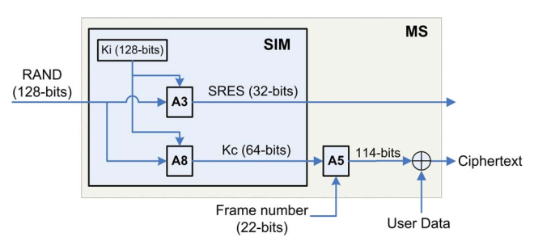

# GSM Security 

The security architecture of GSM was originally intended to provide security services such as anonymity, authentication, and confidentiality of user
data and signaling information.

The security goals of GSM are as follows:

* Authentication of mobile users for the network
* Confidentiality of user data and signaling information
* Anonymity of subscriber's identity
* Using SIM (Subscriber Identity Module) as a security module   

GSM archtecture is shown as follows for the reference.

1. The Mobile Station (MS) consists of the Mobile Equipment (ME), and the SIM card. 

2. The SIM is a cryptographic smart card with the GSM specific applications loaded onto it. As a smart card, it has some inherent security functions specified to smart cards

3. SIM includes all the necessary information to access the subscriber's account. IMSI and Ki are stored on every SIM. 

4. IMSI is the International Mobile Subscriber Identity with at most 15 digits uniquely devoted to every mobile subscriber in the world. 

5. Ki (Individual subscriber authentication Key) is a random 128-bits number that
is the root cryptographic key used for generating session keys, and authenticating the mobile users to the network.

6. Ki is strictly protected and is stored on the subscriber's SIM, and AuC. The SIM is itself protected by an optional Personal Identification Number (PIN)

7. Each user is requested to enter the PIN unless this feature is deactivated by the user. After a number of invalid attempts that is usually 3 times, the SIM locks out the PIN, and the PUK (PIN UnlocK) is then requested. 

8. If the PUK is also incorrectly entered for a number of times that is usually 10 times, the SIM refuses local accesses to its privileged information and authentication functions, and makes itself useless.

9. A3 is mainly used for authenticating users to the network while A8 is used for generating the session key of encryption Kc. 

10. The network sends a random challenge to the user so that SIM produces Kc and SRES. After
user authentication, the network can order the phone to start the encryption by using the generated session key Kc

11. The cryptographic algorithms are implemented on the hardware of mobile phones.

12. The GSM authentication, session key generation, and encryption processes are depicted in Figure

## Challenges to the GSM Security

1. Unilateral authentication and vulnerability to the man-in-the-middle attack
2. Flaws in implementation of A3/A8 algorithms
3. SIM card cloning
4. Over-the-air cracking
5. Flaws in cryptographic algorithms
6. Short range of protection
7. Lack of user visibility
8. Leaking the user anonymity
9. Vulnerability to the DoS attack
10. Absence of integrity protection
11. Vulnerability to replay attacks

References : 

1. [Youtube Link](https://www.youtube.com/watch?v=sdA0pV0Uj1A)

2. [Solutions to the GSM Security Weaknesses By - Mohsen Toorani](GSM_Security.pdf)